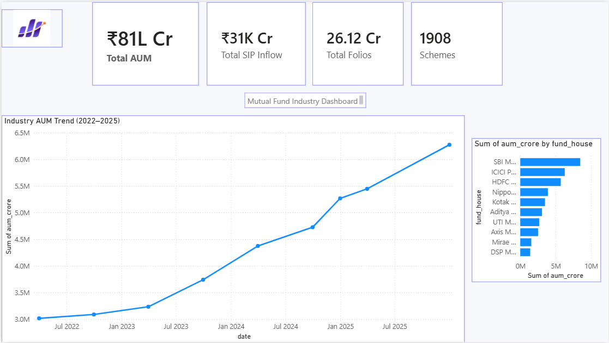
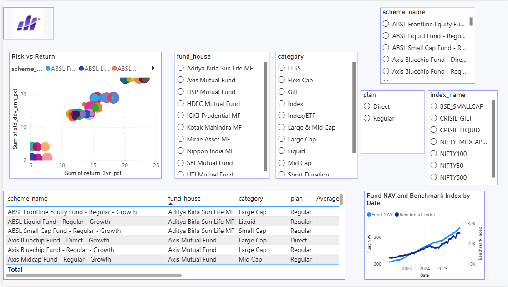
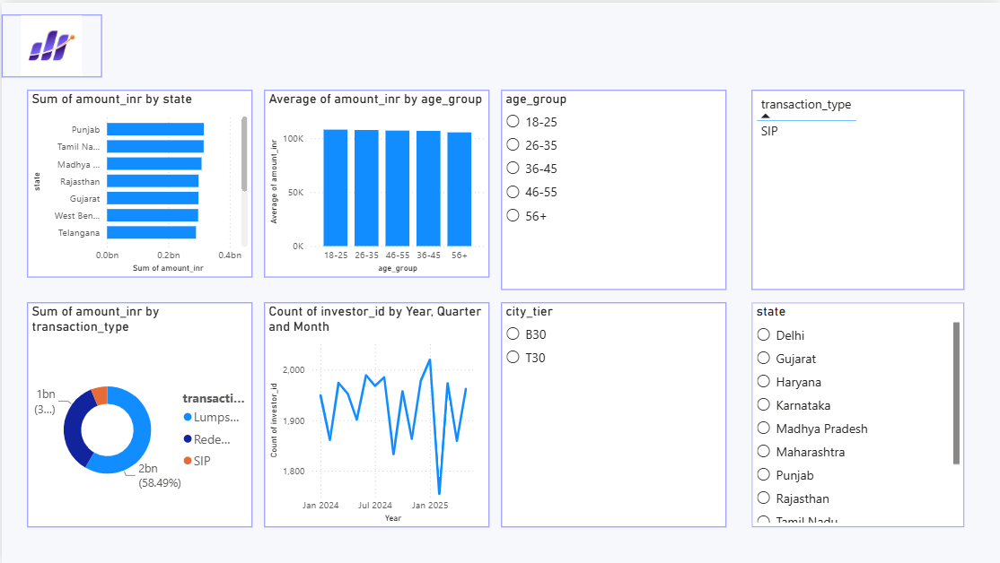
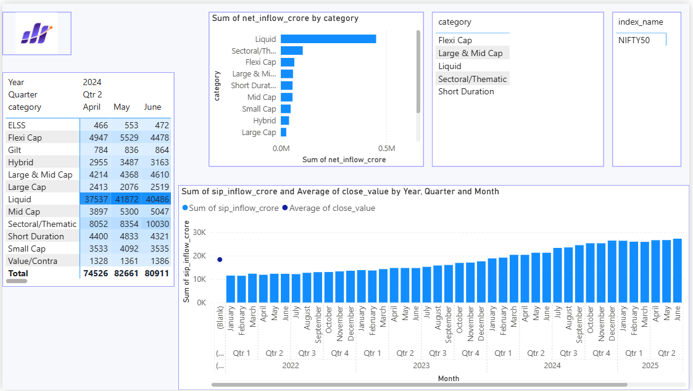

# Mutual Fund Analytics Platform

## Project Overview

The **Mutual Fund Analytics Platform** is an end-to-end data analytics project that demonstrates the complete lifecycle of financial data processing—from data ingestion and validation to interactive business intelligence dashboards.

The project uses **Python, Pandas, SQLite, SQLAlchemy, SQL, and Power BI** to clean, analyze, visualize, and evaluate mutual fund data. It provides meaningful insights into industry trends, fund performance, investor behavior, and SIP market trends through an interactive dashboard.

---

# Objectives

* Perform data ingestion and validation
* Clean and standardize mutual fund datasets
* Build an analytics-ready SQLite database
* Perform SQL-based business analysis
* Conduct Exploratory Data Analysis (EDA)
* Calculate mutual fund performance metrics
* Develop an interactive Power BI dashboard
* Generate business reports and visualizations

---

# Technologies Used

* Python
* Pandas
* NumPy
* Matplotlib
* Seaborn
* SciPy
* SQLite
* SQLAlchemy
* SQL
* Power BI
* Git & GitHub
* VS Code

---

# Day 1 – Data Ingestion & Validation

## Tasks Completed

* Created project folder structure
* Initialized Git repository
* Installed required dependencies
* Loaded raw datasets
* Performed data exploration
* Conducted validation checks
* Identified missing values and duplicate records
* Generated data quality documentation

## Deliverables

* Data ingestion script
* Validation script
* Data quality report

---

# Day 2 – Data Cleaning & Database Development

## Data Cleaning

* Standardized date formats
* Removed duplicate records
* Handled missing values
* Validated numerical fields
* Standardized categorical values
* Performed consistency checks

## Database Development

* Created SQLite database
* Loaded cleaned datasets using SQLAlchemy
* Verified all tables
* Prepared analytics-ready schema

## SQL Analytics

Implemented SQL queries for:

* Asset growth analysis
* Monthly trend analysis
* Transaction analysis
* Geographic analysis
* Expense ratio analysis
* Performance comparison

---

# Day 3 – Exploratory Data Analysis (EDA)

## Analysis Performed

* NAV Trend Analysis
* AUM Analysis
* Category-wise Analysis
* Geographic Analysis
* Investor Demographics
* Correlation Analysis
* Portfolio Allocation
* Business Insights

## Visualizations

* NAV Trends
* AUM Distribution
* SIP Trends
* Category Distribution
* Geographic Distribution
* Investor Demographics
* Folio Growth
* Correlation Matrix
* Sector Allocation

---

# Day 4 – Performance Analytics

## Performance Metrics

Calculated important financial metrics including:

* Daily Returns
* CAGR (1-Year, 3-Year & 5-Year)
* Sharpe Ratio
* Sortino Ratio
* Alpha & Beta
* Maximum Drawdown

## Fund Evaluation

Built a weighted Mutual Fund Scorecard using:

* CAGR
* Sharpe Ratio
* Alpha
* Expense Ratio
* Maximum Drawdown

## Benchmark Comparison

Compared Top Mutual Funds against the NIFTY 50 Benchmark.

---

# Day 5 – Interactive Power BI Dashboard

Developed a professional **4-page Power BI dashboard** for business reporting and decision-making.

## Dashboard Pages

### Page 1 – Industry Overview

* KPI Cards (AUM, SIP Inflows, Folios, Schemes)
* Industry AUM Trend (2022–2025)
* AUM by AMC

### Page 2 – Fund Performance

* Return vs Risk Scatter Plot
* NAV Trend Analysis
* Fund Scorecard
* Interactive Slicers

### Page 3 – Investor Analytics

* State-wise Transaction Analysis
* SIP/Lumpsum/Redemption Distribution
* Age Group Analysis
* Monthly Transaction Trend

### Page 4 – SIP & Market Trends

* SIP Inflow vs NIFTY 50
* Category-wise Inflow Heatmap
* Top Categories by Net Inflow

## Dashboard Features

* Interactive slicers
* Drill-through navigation
* Tooltips
* Bluestock color theme
* Company branding
* Exported PDF report
* High-quality PNG dashboard pages

---

# Project Structure

```text
mutual-fund-analytics/
│
├── data/
├── notebooks/
├── reports/
├── sql/
│
├── Dashboard.pdf
├── Page1_Industry_Overview.png
├── Page2_Fund_Performance.png
├── Page3_Investor_Analytics.png
├── Page4_SIP_Market_Trends.png
├── bluestock_mf_dashboard.pbix
│
├── clean_data.py
├── data_ingestion.py
├── amfi_validation.py
├── fund_analysis.py
│
├── bluestock_mf.db
├── README.md
└── requirements.txt
```

---

# Dashboard Preview

## Page 1 – Industry Overview



---

## Page 2 – Fund Performance



---

## Page 3 – Investor Analytics



---

## Page 4 – SIP & Market Trends



---

# Current Status

* ✅ Data Ingestion Completed
* ✅ Data Validation Completed
* ✅ Data Cleaning Completed
* ✅ SQLite Database Created
* ✅ SQL Analytics Completed
* ✅ Exploratory Data Analysis Completed
* ✅ Performance Analytics Completed
* ✅ Interactive Power BI Dashboard Completed
* ✅ PDF Report Generated
* ✅ Dashboard Screenshots Generated
* ✅ Documentation Completed

---

# Key Outcomes

* Built a complete end-to-end Mutual Fund Analytics Platform.
* Developed an analytics-ready SQLite database.
* Performed SQL-based business analysis.
* Generated meaningful EDA visualizations.
* Calculated industry-standard financial performance metrics.
* Ranked mutual funds using a weighted scorecard.
* Compared top-performing funds with benchmark indices.
* Designed a professional interactive Power BI dashboard.
* Created reusable business reports and documentation.

---

# Future Enhancements

* Live Mutual Fund API Integration
* Automated ETL Pipeline
* Streamlit Web Application
* Portfolio Recommendation Engine
* Risk Prediction Models
* Real-Time Dashboard Refresh
* Cloud Deployment (Azure / AWS)

---

